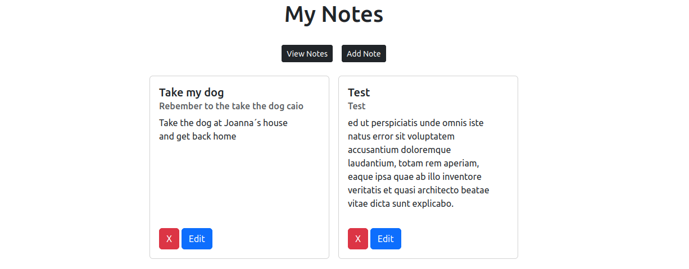

## My Notes App

Aplicação Web feita na linguagem PHP utilizando do framework Laravel. Consistindo
de um espaço para fazer anotações de qualquer tipo através de "Cards" que são armazenados em um banco de dados SQLite.
Dentro é possível criar, ler, editar e remover esses Cards. Sendo alimentados com o texto inserido pelo próprio usuário. Em seguida os dados são armazenados no Banco de Dados e consumidos através  do Eloquent ORM, uma ferramenta  fornecida pelo próprio Laravel para tratar de uma melhor forma as operações com o Banco de Dados.

<h3>Front End</h3>

<ul>
<li>Bootstrap</li>
<li>Blade</li>
<li>Html</li>
<li>Css</li>
</ul>

Para fazer o design e responsividade da aplicação, foi utilizado o framework Bootstrap  que é um framework web com código-fonte aberto para desenvolvimento de componentes de interface e front-end para sites e aplicações web, usando HTML, CSS e JavaScript, baseado em modelos de design para a tipografia,
melhorando a experiência do usuário em um site amigável e responsivo.

Como Template Engine, escolhi utilizar o Blade oferecido nativamente pelo próprio Laravel. Assim como em React, o blade permite transformar arquivos HTML em componentes para serem utilizados em
outras partes do código mais tarde, assim evitando ao máximo duplicação de codigo através da criação de Templates ou Componentes.

O Blade, também atua na segurança da aplicação, garantindo que os dados enviados a mesma partem de um formúlario do próprio site. Isso através
 da inclusão do comando @csrf dentro do formulário, que envia um token de autenticação para a aplicação que valida se o mesmo parte da própria ou de uma fonte externa.

<h3>Back End</h3>

<ul>
<li>Laravel</li>
<li>SQLite</li>
<li>Oloquent ORM</li>
<li>Padrão de Projeto MVC</li>
</ul>

No escopo de Backend, me aproveitei de diversas facilidades que o Laravel oferece
, como a facilidade para criação de rotas, padrão MVC nativo, conexão com o Banco de Dados e operações com o mesmo através do Eloquent.
Escolhi utilizar o SQLite como principal ferramenta de armazenamento pela simplicidade da aplicação, apesar de sua principal função
ser a de servir como um Banco Local, sendo aplamente utilizado em Celulares, Televisões e outros dipositivos na qual há a necessidade de se guardar dados localmente sem passar por um servidor de Dados.
